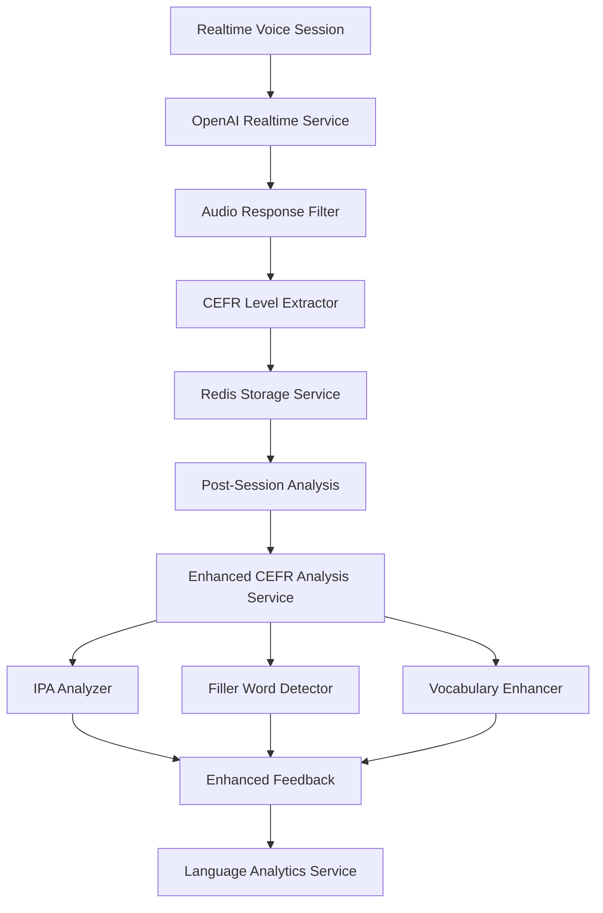

# Design Document: CEFR Evaluation Improvements

## Overview

Este diseño mejora el sistema de evaluación CEFR existente agregando capacidades avanzadas de análisis de pronunciación, detección de muletillas, sugerencias de vocabulario, y extracción automática del nivel CEFR. El sistema mantiene la arquitectura actual mientras extiende las capacidades de análisis tanto en el modelo realtime como en el post-procesamiento.

## Architecture

El sistema mantiene la arquitectura existente con las siguientes extensiones:



### Key Components

1. **Audio Response Filter**: Intercepta respuestas de evaluación final para prevenir reproducción de audio
2. **CEFR Level Extractor**: Extrae niveles CEFR de respuestas de texto usando regex patterns
3. **IPA Analyzer**: Proporciona notación fonética para palabras mal pronunciadas
4. **Filler Word Detector**: Identifica y cuenta muletillas en transcripts
5. **Vocabulary Enhancer**: Sugiere sinónimos y palabras avanzadas

## Components and Interfaces

### 1. Audio Response Filter

```typescript
interface AudioResponseFilter {
  filterEvaluationResponse(response: RealtimeResponse): FilteredResponse;
  isEvaluationResponse(text: string): boolean;
  extractCefrLevel(text: string): CefrLevel | null;
}

interface FilteredResponse {
  text: string;
  shouldPlayAudio: boolean;
  extractedLevel?: CefrLevel;
}
```

### 2. CEFR Level Extractor

```typescript
interface CefrLevelExtractor {
  extractLevel(text: string): CefrLevel | null;
  getEvaluationPatterns(): RegExp[];
}

// Patterns para detectar evaluaciones finales
const EVALUATION_PATTERNS = [
  /I believe you have a ([ABC][12]) level/i,
  /your level is ([ABC][12])/i,
  /you are at ([ABC][12]) level/i,
  /([ABC][12]) level in (English|Spanish)/i
];
```

### 3. Enhanced IPA Analyzer

```typescript
interface IpaAnalyzer {
  getIpaNotation(word: string, language: Language): string | null;
  analyzePronunciationErrors(
    transcript: string, 
    audioData: AudioAnalysis
  ): PronunciationError[];
}

interface PronunciationError {
  word: string;
  expectedIpa: string;
  detectedIssue: string;
  confidence: number;
}

// Utilizará diccionarios IPA integrados para inglés y español
const IPA_DICTIONARIES = {
  english: new Map<string, string>(), // word -> IPA
  spanish: new Map<string, string>()
};
```

### 4. Filler Word Detector

```typescript
interface FillerWordDetector {
  detectFillers(transcript: string, language: Language): FillerAnalysis;
  getFillerPatterns(language: Language): string[];
  calculateFillerImpact(fillerCount: number, totalWords: number): number;
}

interface FillerAnalysis {
  fillerWords: string[];
  fillerCount: number;
  totalWords: number;
  fillerRatio: number;
  impactOnFluency: number;
}

// Patrones de muletillas por idioma
const FILLER_PATTERNS = {
  english: ['um', 'uh', 'like', 'you know', 'actually', 'basically', 'literally'],
  spanish: ['eh', 'este', 'pues', 'o sea', 'bueno', 'entonces', 'como que']
};
```

### 5. Vocabulary Enhancer

```typescript
interface VocabularyEnhancer {
  suggestAdvancedWords(
    usedWords: string[], 
    context: string, 
    targetLevel: CefrLevel
  ): VocabularySuggestion[];
  analyzeWordComplexity(words: string[]): WordComplexityAnalysis;
}

interface VocabularySuggestion {
  originalWord: string;
  suggestions: {
    word: string;
    level: CefrLevel;
    context: string;
  }[];
}

interface WordComplexityAnalysis {
  basicWords: string[];
  intermediateWords: string[];
  advancedWords: string[];
  repeatedWords: { word: string; count: number }[];
}
```

## Data Models

### Enhanced Feedback Structure

La estructura existente se mantiene, pero se mejoran los campos:

```typescript
interface EnhancedPronunciationFeedback {
  score: number;
  mispronouncedWords: {
    word: string;
    attempts: number;
    lastHeard: Date;
    ipa: string; // Ahora siempre presente
    notes: string; // Más específico sobre dificultades fonéticas
    confidence: number; // Nueva: confianza en la detección
  }[];
  overallIssues: string[]; // Nueva: patrones generales de pronunciación
}

interface EnhancedFluencyFeedback {
  score: number;
  wordsPerMinute: number;
  nativeRange: { min: number; max: number };
  pausesPerMinute: number;
  fillerWordsCount: number; // Nueva
  fillerWordsRatio: number; // Nueva
  mostUsedWords: { word: string; count: number }[]; // Nueva
}

interface EnhancedVocabularyFeedback {
  score: number;
  rareWordsUsed: string[];
  repeatedWords: string[];
  suggestedWords: string[];
  advancedAlternatives: { // Nueva
    original: string;
    suggestions: string[];
  }[];
  vocabularyLevel: CefrLevel; // Nueva: nivel estimado del vocabulario usado
}
```

### Session Analysis Result

```typescript
interface EnhancedAnalysisResult extends CefrAnalysisResult {
  extractedLevel?: CefrLevel; // Nivel extraído de la respuesta final
  audioSuppressed: boolean; // Si se suprimió el audio de evaluación
  analysisMetadata: {
    fillerAnalysis: FillerAnalysis;
    vocabularyAnalysis: WordComplexityAnalysis;
    pronunciationConfidence: number;
  };
}
```

## Correctness Properties

*A property is a characteristic or behavior that should hold true across all valid executions of a system-essentially, a formal statement about what the system should do. Properties serve as the bridge between human-readable specifications and machine-verifiable correctness guarantees.*

### Property Reflection

Después de analizar todos los criterios de aceptación, se identificaron las siguientes propiedades únicas que proporcionan valor de validación sin redundancia:

**Propiedades consolidadas:**
- Extracción de nivel CEFR y filtrado de audio se combinan en una propiedad integral
- Análisis de pronunciación, fluidez y vocabulario se agrupan por dominio funcional
- Compatibilidad y robustez se validan como propiedades de sistema

### Core Properties

**Property 1: CEFR Level Extraction and Audio Filtering**
*For any* evaluation response text containing CEFR level patterns, the system should correctly extract the level, assign it to the feedback, and mark the response as text-only without audio playback
**Validates: Requirements 1.1, 1.2, 1.5, 5.1, 5.2, 5.4**

**Property 2: Fallback Level Assignment**
*For any* evaluation text without valid CEFR patterns, the system should assign a default level based on previous analysis metrics without failing
**Validates: Requirements 1.4**

**Property 3: IPA Notation Completeness**
*For any* mispronounced word detected in supported languages, the system should provide valid IPA notation and detailed phonetic feedback
**Validates: Requirements 2.2, 2.4, 2.5**

**Property 4: Pronunciation Error Tracking**
*For any* pronunciation error detection, the system should record attempt count, timestamp, and confidence metrics accurately
**Validates: Requirements 2.1, 2.3**

**Property 5: Filler Word Detection Accuracy**
*For any* transcript in supported languages, the system should correctly identify and count all filler words according to language-specific patterns
**Validates: Requirements 3.1, 3.2, 3.5**

**Property 6: Word Frequency Analysis**
*For any* user transcript, the system should accurately identify the most frequently used words and calculate appropriate fluency impact
**Validates: Requirements 3.3, 3.4**

**Property 7: Vocabulary Classification and Enhancement**
*For any* set of user vocabulary, the system should correctly classify word complexity levels and generate appropriate advanced alternatives
**Validates: Requirements 4.1, 4.2, 4.5**

**Property 8: Context-Appropriate Suggestions**
*For any* CEFR level and vocabulary set, suggested words should be appropriately leveled and contextually relevant
**Validates: Requirements 4.3**

**Property 9: Cross-Mode Audio Filtering**
*For any* conversation mode (practice or test), evaluation responses should be consistently filtered for audio suppression
**Validates: Requirements 5.3, 5.5**

**Property 10: Realtime-NonRealtime Integration**
*For any* completed realtime session, the transcript should be successfully processed by non-realtime analysis and results properly merged
**Validates: Requirements 6.1, 6.2, 6.3, 6.4**

**Property 11: Backward Compatibility Preservation**
*For any* existing API call or data structure, the enhanced system should maintain full compatibility while adding new fields
**Validates: Requirements 7.1, 7.2, 7.3, 7.5**

**Property 12: Error Handling Robustness**
*For any* error condition or invalid input, the system should handle gracefully with appropriate fallbacks without breaking existing functionality
**Validates: Requirements 7.4**

## Error Handling

### Error Categories and Strategies

1. **IPA Lookup Failures**
   - Fallback to phonetic approximation
   - Log missing words for dictionary improvement
   - Provide generic pronunciation notes

2. **Filler Detection Errors**
   - Use conservative detection to avoid false positives
   - Maintain language-specific confidence thresholds
   - Fallback to basic word counting if pattern matching fails

3. **CEFR Extraction Failures**
   - Use analysis-based level estimation as fallback
   - Log extraction failures for pattern improvement
   - Maintain previous level if no valid extraction

4. **Audio Filter Bypass**
   - Implement multiple detection patterns for robustness
   - Use conservative approach (suppress when in doubt)
   - Log bypass incidents for monitoring

5. **Integration Failures**
   - Graceful degradation to realtime-only analysis
   - Retry mechanisms for temporary failures
   - Clear error reporting to users

### Monitoring and Logging

```typescript
interface AnalysisMetrics {
  cefrExtractionSuccess: number;
  ipaLookupSuccess: number;
  fillerDetectionAccuracy: number;
  audioFilterEffectiveness: number;
  integrationLatency: number;
}
```

## Testing Strategy

### Dual Testing Approach

El sistema utilizará tanto pruebas unitarias como pruebas basadas en propiedades para asegurar cobertura completa:

**Unit Tests:**
- Casos específicos de extracción de CEFR con patrones conocidos
- Ejemplos concretos de palabras con IPA verificado
- Casos edge de manejo de errores
- Integración entre componentes específicos

**Property-Based Tests:**
- Generación aleatoria de respuestas de evaluación para probar extracción robusta
- Transcripts aleatorios con muletillas para validar detección
- Vocabulario aleatorio para probar clasificación y sugerencias
- Condiciones de error aleatorias para validar robustez

### Property Test Configuration

- **Minimum iterations:** 100 por propiedad
- **Test framework:** Jest con fast-check para property-based testing
- **Tag format:** `Feature: cefr-evaluation-improvements, Property {number}: {property_text}`

### Test Data Strategy

1. **IPA Dictionary Testing**
   - Usar diccionarios verificados de CMU y otros recursos académicos
   - Validar contra pronunciaciones conocidas
   - Probar con palabras de diferentes complejidades fonéticas

2. **Filler Word Validation**
   - Corpus de transcripts reales con muletillas marcadas
   - Validación cruzada con herramientas existentes
   - Pruebas con diferentes acentos y dialectos

3. **CEFR Pattern Testing**
   - Generar variaciones de patrones de evaluación
   - Probar con diferentes formatos de respuesta
   - Validar extracción en múltiples idiomas

### Integration Testing

- Pruebas end-to-end con sesiones simuladas completas
- Validación de flujo realtime → non-realtime → feedback
- Pruebas de compatibilidad con APIs existentes
- Pruebas de rendimiento con volúmenes realistas

### Performance Requirements

- Extracción de CEFR: < 10ms por respuesta
- Análisis IPA: < 50ms por palabra
- Detección de muletillas: < 100ms por transcript
- Análisis completo post-sesión: < 5 segundos

El enfoque de testing asegura que tanto la funcionalidad específica como las propiedades universales del sistema sean validadas comprehensivamente, manteniendo la robustez y confiabilidad del sistema existente mientras se agregan las nuevas capacidades.